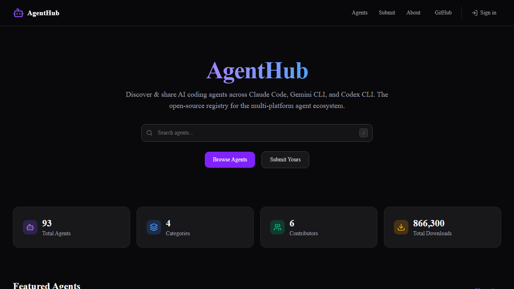
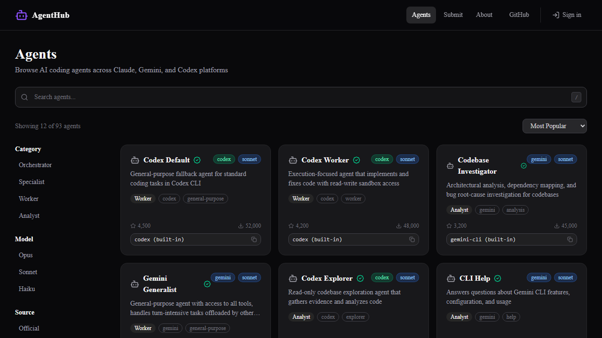
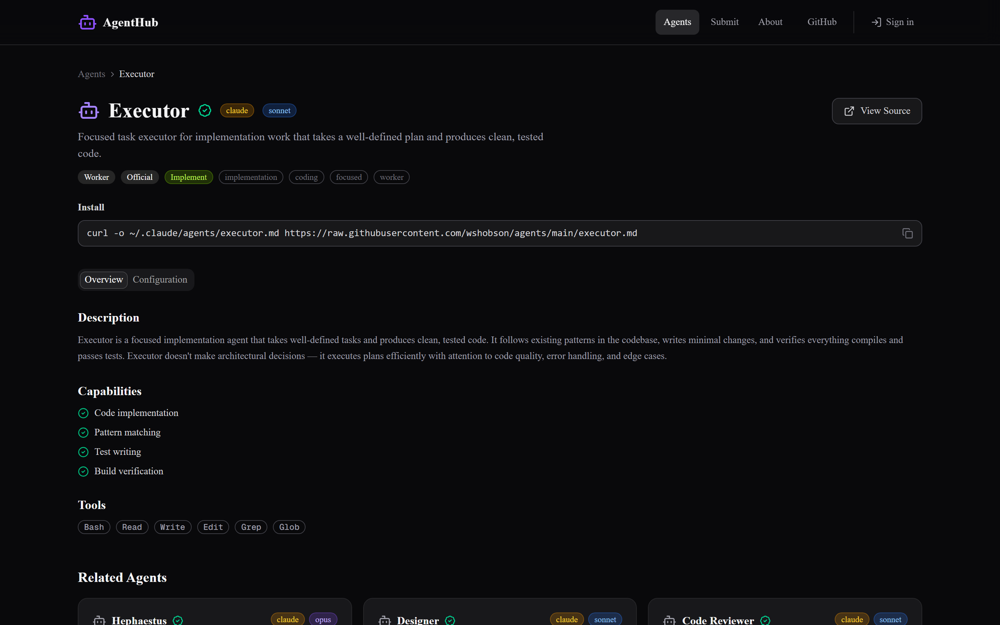
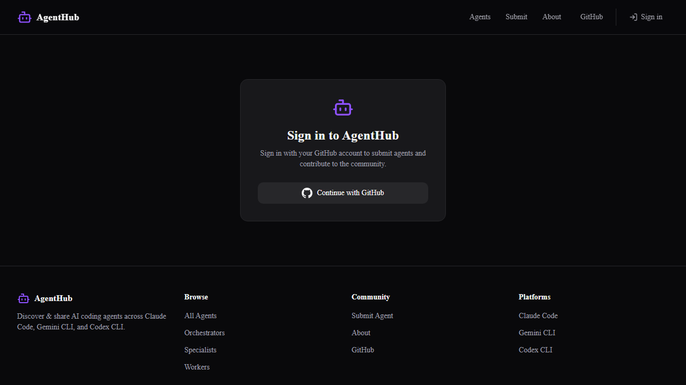

# AgentHub

[](https://github.com/sehoon787/agent-hub/actions/workflows/ci.yml)
[](./LICENSE)
[](./docs/contributing.md)

**The open-source registry for AI coding agents.**

> Smithery indexes MCP servers. SkillHub catalogs skills.
> **AgentHub is where you find agents.**

**Live**: [agent-hub-omega.vercel.app](https://agent-hub-omega.vercel.app)

## The Problem

AI coding agents are everywhere -- Claude Code ships subagents, Gemini CLI has built-in agents, Codex CLI introduced worker/explorer roles. But there's no central place to discover them.

- Agents are scattered across GitHub repos, plugin marketplaces, and documentation pages
- No standardized way to compare agents across platforms
- Developers waste time searching for the right agent for their task

## The Solution

AgentHub is a unified registry that collects, verifies, and presents AI coding agents from across the ecosystem:

| Platform | Agents | Format | Status |
|----------|--------|--------|--------|
| **Claude Code** | 80 agents | `.md` with YAML frontmatter | ✅ Supported |
| **Gemini CLI** | 8 agents | `.md` with YAML frontmatter | ✅ Supported |
| **Codex CLI** | 3 agents | `.toml` files | ✅ Supported |
| **Universal** | 2 agents | Cross-platform | ✅ Supported |
| **Cursor** | — | `.cursor/rules/` | Rules only (no agents) |
| **Windsurf** | — | `.windsurf/rules/` | Rules only (no agents) |
| **Aider** | — | `CONVENTIONS.md` | Conventions only (no agents) |

### Key Features

- **Search & Filter** -- Find agents by name, category, model, or platform
- **Verified Agents** -- Every listed agent is validated against its source
- **Community Submissions** -- Submit agents with GitHub OAuth and automatic security checks
- **Auto-Collection** -- Agents are periodically discovered from GitHub repositories
- **Analytics** -- Vercel Analytics for usage tracking
- **Security** -- Malicious content detection on all submissions

### Agent Categories

| Category | Description | Example |
|----------|-------------|---------|
| **Orchestrator** | Coordinate multi-agent workflows | boss, sisyphus, atlas |
| **Specialist** | Deep domain expertise | security-reviewer, debugger |
| **Worker** | Execute implementation tasks | executor, writer |
| **Analyst** | Read-only analysis and strategy | oracle, critic, metis |

## Screenshots



**Homepage** — Search and discover agents



**Browse** — Filter by category, platform, and model



**Detail** — Install commands, capabilities, and configuration



**Submit** — Contribute your agents via GitHub OAuth

## Usage

### Browse Agents

Visit [agent-hub-omega.vercel.app](https://agent-hub-omega.vercel.app) and use the search bar or filters (category, platform, model) to find agents that fit your workflow.

### Install an Agent

Copy the install command from the agent detail page. For example:

```bash
curl -o ~/.claude/agents/boss.md https://agent-hub-omega.vercel.app/agents/boss/raw
```

### Submit an Agent

Sign in with GitHub, fill out the submission form with your agent's details, and submit. Your submission creates a GitHub Issue for review before it is listed in the registry.

## Quick Start

```bash
git clone https://github.com/sehoon787/agent-hub.git
cd agent-hub
npm install
cp .env.example .env.local
npm run dev -- --port 3100
```

**Full documentation**: [docs/](./docs/)

- [Setup Guide](./docs/setup.md) -- Environment variables, GitHub OAuth, GITHUB_TOKEN
- [Deployment](./docs/deployment.md) -- Vercel deployment step-by-step
- [API Reference](./docs/api.md) -- REST API endpoints
- [Contributing](./docs/contributing.md) -- How to submit agents and contribute
- [Architecture](./docs/architecture.md) -- Project structure and tech stack

## Tech Stack

Next.js 15 · TypeScript · Tailwind CSS v4 · shadcn/ui · Auth.js v5 · Vercel Analytics · Vercel

## License

MIT
